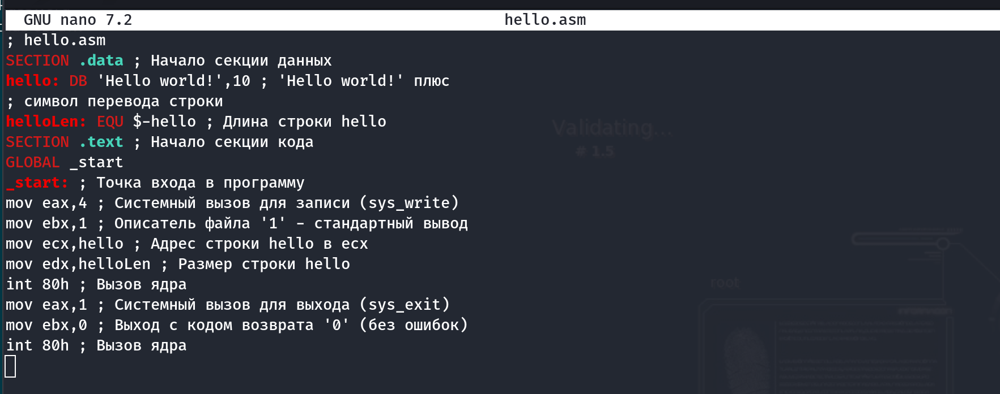
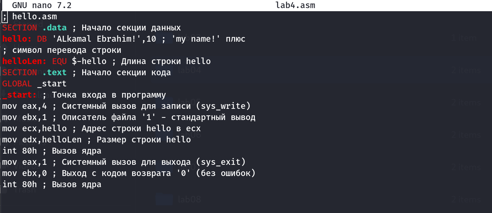
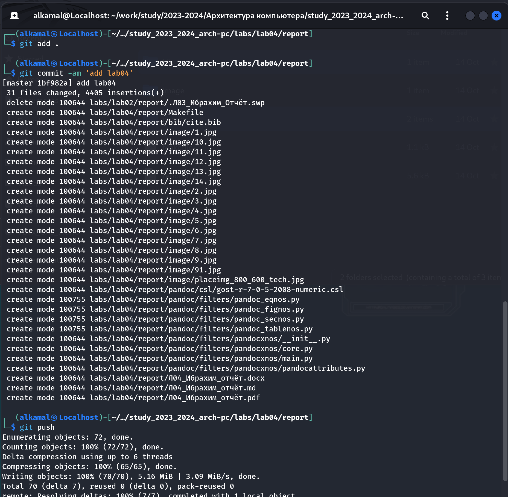

---
## Front matter
title: "Архитектура компьютера"
subtitle: "Отчёт по лабораторной работе №4"
author: "Ибрахим Мохсейн Алькамал"

## Generic otions
lang: ru-RU
toc-title: "Содержание"

## Bibliography
bibliography: bib/cite.bib
csl: pandoc/csl/gost-r-7-0-5-2008-numeric.csl

## Pdf output format
toc: true # Table of contents
toc-depth: 2
lof: true # List of figures
lot: true # List of tables
fontsize: 12pt
linestretch: 1.5
papersize: a4
documentclass: scrreprt
## I18n polyglossia
polyglossia-lang:
  name: russian
  options:
	- spelling=modern
	- babelshorthands=true
polyglossia-otherlangs:
  name: english
## I18n babel
babel-lang: russian
babel-otherlangs: english
## Fonts
mainfont: PT Serif
romanfont: PT Serif
sansfont: PT Sans
monofont: PT Mono
mainfontoptions: Ligatures=TeX
romanfontoptions: Ligatures=TeX
sansfontoptions: Ligatures=TeX,Scale=MatchLowercase
monofontoptions: Scale=MatchLowercase,Scale=0.9
## Biblatex
biblatex: true
biblio-style: "gost-numeric"
biblatexoptions:
  - parentracker=true
  - backend=biber
  - hyperref=auto
  - language=auto
  - autolang=other*
  - citestyle=gost-numeric
## Pandoc-crossref LaTeX customization
figureTitle: "Рис."
tableTitle: "Таблица"
listingTitle: "Листинг"
lofTitle: "Список иллюстраций"
lotTitle: "Список таблиц"
lolTitle: "Листинги"
## Misc options
indent: true
header-includes:
  - \usepackage{indentfirst}
  - \usepackage{float} # keep figures where there are in the text
  - \floatplacement{figure}{H} # keep figures where there are in the text
---

# Цель работы

Освоение процедуры компиляции и сборки программ, написанных на ассемблере NASM.

# Задание

1) Создать программу Hello world
2) Работа с транслятором NASM
3) Работа с расширенным синтаксисом командой строки NASM
4) Работа с компоновщиком LD
5) Запуск исполняемого файла
6) Выполнение заданий для самостоятельной работы

# Теоретическое введение

Основной задачей процессора является обработка информации, а также организация
координации всех узлов компьютера. В состав центрального процессора (ЦП) входят
следующие устройства:
- арифметико-логическое устройство (АЛУ) — выполняет логические и арифметические действия, необходимые для обработки информации, хранящейся в памяти;
- устройство управления (УУ) — обеспечивает управление и контроль всех устройств
компьютера;
- регистры — сверхбыстрая оперативная память небольшого объёма, входящая в состав процессора, для временного хранения промежуточных результатов выполнения
инструкций; регистры процессора делятся на два типа: регистры общего назначения и
специальные регистры
В процессе создания ассемблерной программы можно выделить четыре шага:
- Набор текста программы в текстовом редакторе и сохранение её в отдельном файле.
Каждый файл имеет свой тип (или расширение), который определяет назначение файла.
Файлы с исходным текстом программ на языке ассемблера имеют тип asm.
- Трансляция — преобразование с помощью транслятора, например nasm, текста программы в машинный код, называемый объектным. На данном этапе также может быть
получен листинг программы, содержащий кроме текста программы различную дополнительную информацию, созданную транслятором. Тип объектного файла — o, файла
листинга — lst.
- Компоновка или линковка — этап обработки объектного кода компоновщиком (ld),
который принимает на вход объектные файлы и собирает по ним исполняемый файл.
Исполняемый файл обычно не имеет расширения. Кроме того, можно получить файл
карты загрузки программы в ОЗУ, имеющий расширение map.
- Запуск программы. Конечной целью является работоспособный исполняемый файл.
Ошибки на предыдущих этапах могут привести к некорректной работе программы,
поэтому может присутствовать этап отладки программы при помощи специальной
программы — отладчика. При нахождении ошибки необходимо провести коррекцию
программы, начиная с первого шага.
В качестве примера приведем названия основных регистров общего назначения (именно
эти регистры чаще всего используются при написании программ):

* RAX, RCX, RDX, RBX, RSI, RDI — 64-битные
* EAX, ECX, EDX, EBX, ESI, EDI — 32-битные
* AX, CX, DX, BX, SI, DI — 16-битные
* AH, AL, CH, CL, DH, DL, BH, BL — 8-битные (половинки 16-битных регистров). Например,

AH (high AX) — старшие 8 бит регистра AX, AL (low AX) — младшие 8 бит регистра AX.
В состав ЭВМ также входят периферийные устройства, которые можно разделить на:
- устройства внешней памяти, которые предназначены для долговременного хранения больших объёмов данных (жёсткие диски, твердотельные накопители, магнитные
ленты);
- устройства ввода-вывода, которые обеспечивают взаимодействие ЦП с внешней
средой.
В основе вычислительного процесса ЭВМ лежит принцип программного управления.
Это означает, что компьютер решает поставленную задачу как последовательность действий,
записанных в виде программы. Программа состоит из машинных команд, которые указывают, какие операции и над какими данными (или операндами), в какой последовательности
необходимо выполнить.
Набор машинных команд определяется устройством конкретного процессора. Коды команд представляют собой многоразрядные двоичные комбинации из 0 и 1. В коде машинной
команды можно выделить две части: операционную и адресную. В операционной части хранится код команды, которую необходимо выполнить. В адресной части хранятся данные
или адреса данных, которые участвуют в выполнении данной операции.
При выполнении каждой команды процессор выполняет определённую последовательность стандартных действий, которая называется командным циклом процессора. В
самом общем виде он заключается в следующем:

1. формирование адреса в памяти очередной команды;
2. считывание кода команды из памяти и её дешифрация;
3. выполнение команды;
4. переход к следующей команде.

# Выполнение лабораторной работы

1) Создаю рекурсивно вложенные в папку work папки arch-pc и lab04, проверяю их создание

{width=70%}

2) Перехожу в созданную папку

{width=70%}

3) Создаю файл hello с разрешением asm и проверяю его создание

{ width=70%}

4) Открываю этот файл в nano и копирую туда код из задания лабораторной работы

{ width=70%}

5) Скачиваю nasm

{ width=70%}

6) Преобразовываю файл hello.asm в объектный код, записанный в файл hello.o. Проверяю, был ли создан файл

{ width=70%}

7) Преобразую файл hello.asm в obj.o с помощью опции -o, которая позволяет задать имя объекта. Из-за elf -g формат выходного файла будет elf, и в него будут включены символы для отладки, а так же будет создан файл листинга list.lst, благодаря -l. Проверяю созданные файлы

{ width=70%}

8) Передаю файл компановщику с помощью ld. Проверяю, создан ли исполняемый файл

{ width=70%}

9) Передаю компановщику файл obj.o и называю скомпанованный файл main. запуская сначала код для предыдущего файла(1), а затем для созданного сейчас(2)

{ width=70%}

{ width=70%}

# Выполнение заданий для самостоятельной работы

1) Копирую hello.asm с названием lab4.asm

{ width=70%}

2) С помощью nano изменяю текст кода так, чтобы он выводил моё имя и фамилию

{ width=70%}

3) Транслирую файл lab4.asm в объектный

{ width=70%}

4) Выполняю компановку и запускаю исполняемый файл

{ width=70%}

5) Копирую файлы в мой локальный репозиторий 

{ width=70%}

6) Выгружаю изменения на GitHub

{#fig:001 width=70%}

# Выводы

Я освоила процедуры компиляции и сборки программ, написанных на ассемблере NASM

# Список литературы{.unnumbered}
  [#refs https://esystem.rudn.ru/mod/resource/view.php?id=1030552](https://esystem.rudn.ru/mod/resource/view.php?id=1030552)

