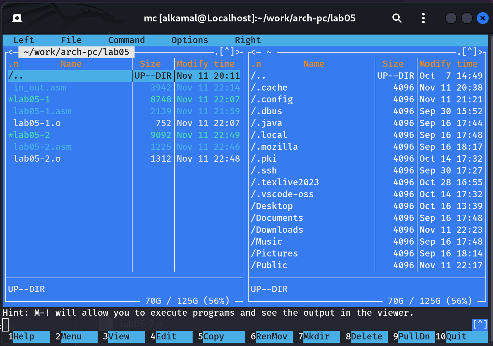
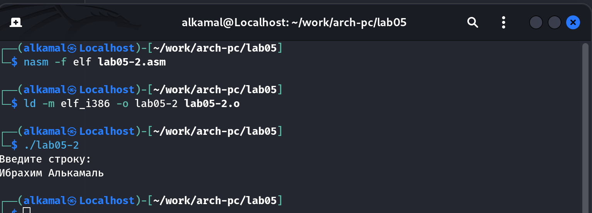
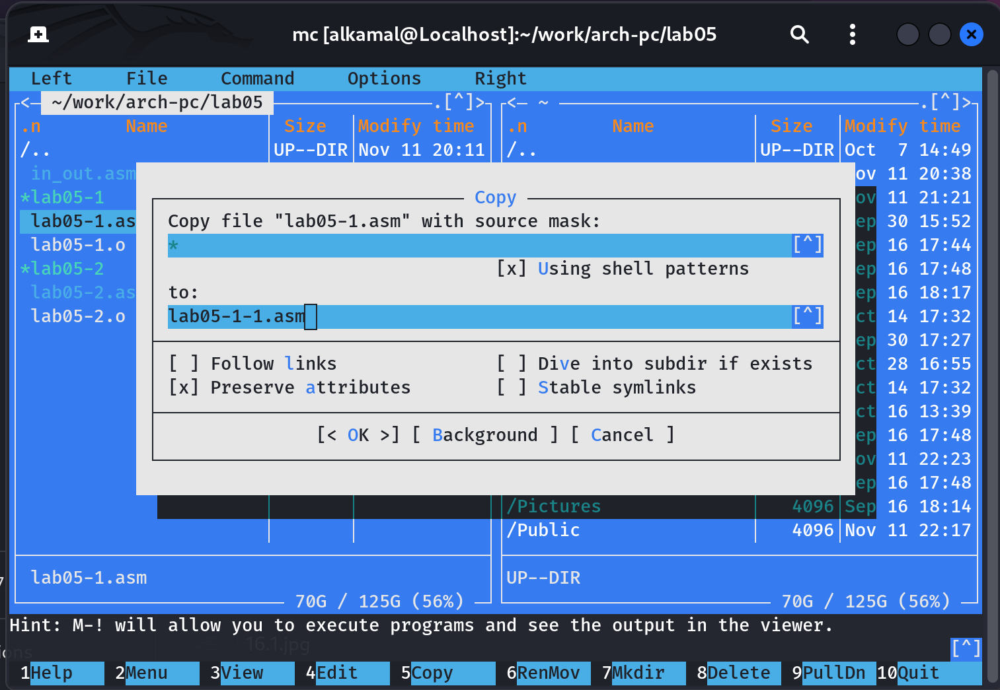

---
## Front matter
title: "Архитектура компьютера"
subtitle: "Отчёт по лабораторной работе №5"
author: "Ибрахим Мохсейн Алькамал"

## Generic otions
lang: ru-RU
toc-title: "Содержание"

## Bibliography
bibliography: bib/cite.bib
csl: pandoc/csl/gost-r-7-0-5-2008-numeric.csl

## Pdf output format
toc: true # Table of contents
toc-depth: 2
lof: true # List of figures
lot: true # List of tables
fontsize: 12pt
linestretch: 1.5
papersize: a4
documentclass: scrreprt
## I18n polyglossia
polyglossia-lang:
  name: russian
  options:
	- spelling=modern
	- babelshorthands=true
polyglossia-otherlangs:
  name: english
## I18n babel
babel-lang: russian
babel-otherlangs: english
## Fonts
mainfont: PT Serif
romanfont: PT Serif
sansfont: PT Sans
monofont: PT Mono
mainfontoptions: Ligatures=TeX
romanfontoptions: Ligatures=TeX
sansfontoptions: Ligatures=TeX,Scale=MatchLowercase
monofontoptions: Scale=MatchLowercase,Scale=0.9
## Biblatex
biblatex: true
biblio-style: "gost-numeric"
biblatexoptions:
  - parentracker=true
  - backend=biber
  - hyperref=auto
  - language=auto
  - autolang=other*
  - citestyle=gost-numeric
## Pandoc-crossref LaTeX customization
figureTitle: "Рис."
tableTitle: "Таблица"
listingTitle: "Листинг"
lofTitle: "Список иллюстраций"
lotTitle: "Список таблиц"
lolTitle: "Листинги"
## Misc options
indent: true
header-includes:
  - \usepackage{indentfirst}
  - \usepackage{float} # keep figures where there are in the text
  - \floatplacement{figure}{H} # keep figures where there are in the text
---

# Цель работы

Приобретение практических навыков работы в Midnight Commander. Освоение инструкций
языка ассемблера mov и int

# Задание

1. Откройте Midnight Commander
user@dk4n31:~$ mc
2. Пользуясь клавишами ↑ , ↓ и Enter перейдите в каталог ~/work/arch-pc созданный
при выполнении лабораторной работы №4. 
3. С помощью функциональной клавиши F7 создайте папку lab05 и перейдите
в созданный каталог.
4. Пользуясь строкой ввода и командой touch создайте файл lab5-1.asm.
5. С помощью функциональной клавиши F4 откройте файл lab5-1.asm для редактирования во встроенном редакторе. Как правило в качестве встроенного редактора Midnight
Commander используется редакторы nano или mcedit.
6. Введите текст программы из листинга 5.1 (можно без комментариев), сохраните изменения и закройте файл.
7. С помощью функциональной клавиши F3 откройте файл lab5-1.asm для просмотра.
Убедитесь, что файл содержит текст программы.
8. Оттранслируйте текст программы lab5-1.asm в объектный файл. Выполните компоновку объектного файла и запустите получившийся исполняемый файл.
выводит строку 'Введите строку:' и ожидает ввода с клавиатуры. На запрос введите
Ваши ФИО.
9. Скачайте файл in_out.asm со страницы курса в ТУИС.
10. Подключаемый файл in_out.asm должен лежать в том же каталоге, что и файл с программой, в которой он используется.
11. С помощью функциональной клавиши F6 создайте копию файла lab5-1.asm с именем
lab5-2.asm. Выделите файл lab5-1.asm, нажмите клавишу F6 , введите имя файла
lab5-2.asm и нажмите клавишу Enter
12. Исправьте текст программы в файле lab5-2.asm с использование подпрограмм из
внешнего файла in_out.asm (используйте подпрограммы sprintLF, sread и quit) в
соответствии с листингом 5.2. Создайте исполняемый файл и проверьте его работу.


# Теоретическое введение

Midnight Commander (или просто mc) — это программа, которая позволяет просматривать
структуру каталогов и выполнять основные операции по управлению файловой системой,
т.е. mc является файловым менеджером. Midnight Commander позволяет сделать работу с
файлами более удобной и наглядной.
Для активации оболочки Midnight Commander достаточно ввести в командной строке mc и
нажать клавишу Enter (рис. 5.1).
В Midnight Commander используются функциональные клавиши F1 — F10 , к которым
привязаны часто выполняемые операции (табл. 5.1).
Таблица 5.1. Функциональные клавиши Midnight Commander
Функциональные
клавиши Выполняемое действие
F1 вызов контекстно-зависимой подсказки
F2 вызов меню, созданного пользователем
F3 просмотр файла, на который указывает подсветка в активной панели
F4 вызов встроенного редактора для файла, на который указывает подсветка в
активной панели
F5 копирование файла или группы отмеченных файлов из каталога,
отображаемого в активной панели, в каталог, отображаемый на второй
панели
F6 перенос файла или группы отмеченных файлов из каталога, отображаемого
в активной панели, в каталог, отображаемый на второй панели
F7 создание подкаталога в каталоге, отображаемом в активной панели
F8 удаление файла (подкаталога) или группы отмеченных файлов
F9 вызов основного меню программы
F10 выход из программы


# Выполнение лабораторной работы

1) Открываю Midnight Commander с помощью команды mc

{ width=70%}

2) с помощью клавиш ↑ , ↓ и Enter перехожу в каталог ~/work/arch-pc созданный при выполнении лабораторной работы №4 (рисунки 2 и 3)

{ width=70%}

{ width=70%}

3) С помощью F7 создаю папку lab05

{ width=70%}

4) Перехожу в созданный каталог и с помощью touch создаю lab5-1.asm

{ width=70%}

Созданный файл

{ width=70%}

5) С помощью F4 открываю файл lab5-1.asm во встроенном редакторе, в моём случае - nano, и копирую туда код из задания лабораторной работы, сохраняю изменения

{ width=70%}

6) С помощью F3 открываю файл и смотрю на сохраненные изменения

{ width=70%}

7) Оттранслирую в объектный файл и выполняю компоновку файла (8-9) 

{ width=70%}

{ width=70%}

8) Работа файла

{ width=70%}

9) Скачиваю in_out.asm и открываю во втором окне

{ width=70%}

10) С помощью F5 копирую файл в нужную папку

{ width=70%}

11) С помощью F5 создаю копию файла lab5-1.asm с именем
lab5-2.asm. (13-14)

{ width=70%}

{ width=70%}

12) Открываю lab5-2.asm для редактирования в mcedit

{ width=70%}

13) Оттранслирую в объектный файл и выполняю компоновку файла (16-17)

{ width=70%}

{ width=70%}

14) Заменяю подпрограмму sprintLF на sprint, создаю файл и проверяю его работу (18-19)

{ width=70%}

{ width=70%}

# Выполнение заданий для самостоятельной работы 

1) Копирую lab5-1.asm как lab5-1-1.asm

{ width=70%}

2) Открываю его с помощью mcedit

{ width=70%}

3) Вношу изменения так, чтобы программа возвращала введённое значение

код программы:

```
SECTION .data ; Секция инициированных данных
msg: DB 'Введите строку:',10 ; сообщение плюс
; символ перевода строки
msgLen: EQU $-msg ; Длина переменной 'msg'
SECTION .bss ; Секция не инициированных данных
buf1: RESB 80 ; Буфер размером 80 байт
SECTION .text ; Код программы
GLOBAL _start ; Начало программы
_start: ; Точка входа в программу
mov eax,4 ; Системный вызов для записи (sys_write)
mov ebx,1 ; Описатель файла 1 - стандартный вывод
mov ecx,msg ; Адрес строки 'msg' в 'ecx'
mov edx,msgLen ; Размер строки 'msg' в 'edx'
int 80h ; Вызов ядра
mov eax, 3 ; Системный вызов для чтения (sys_read)
mov ebx, 0 ; Дескриптор файла 0 - стандартный ввод
mov ecx, buf1 ; Адрес буфера под вводимую строку
mov edx, 80 ; Длина вводимой строки
int 80h ; Вызов ядра
mov eax, 4 ;
mov ebx, 1 ;
mov ecx, buf1 ;
mov edx buf1 ;
int 80h ;
mov eax,1 ; Системный вызов для выхода (sys_exit)
mov ebx,0 ; Выход с кодом возврата 0 (без ошибок)
int 80h ; Вызов ядра

```

{ width=70%}

4) Создаю исполняемый файл и запускаю программу 

{ width=70%}


# Выводы

Я приобрела практические навыки работы в Midnight Commander и освоила инструкции
языка ассемблера mov и int

# Список литературы{.unnumbered}

::: {#refs}
:::
